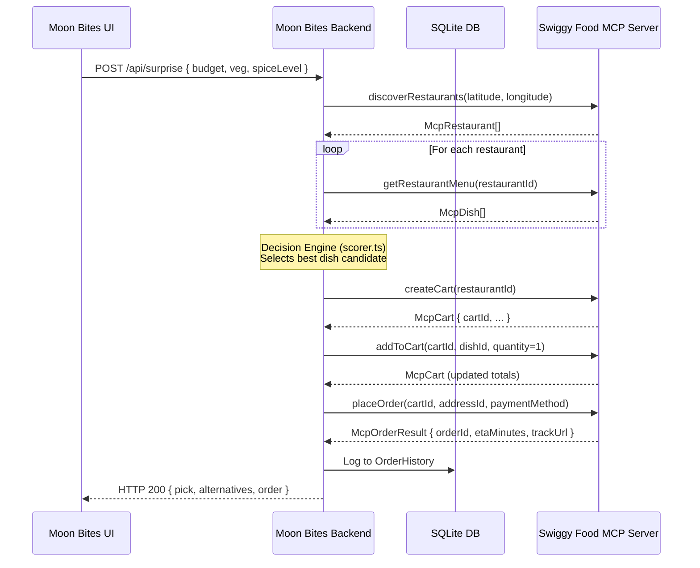
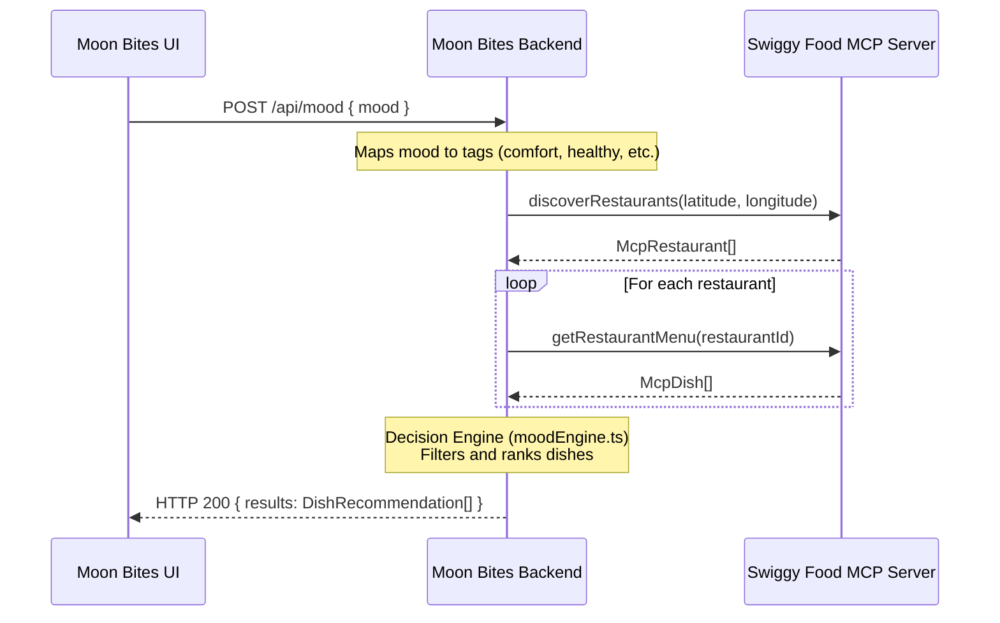
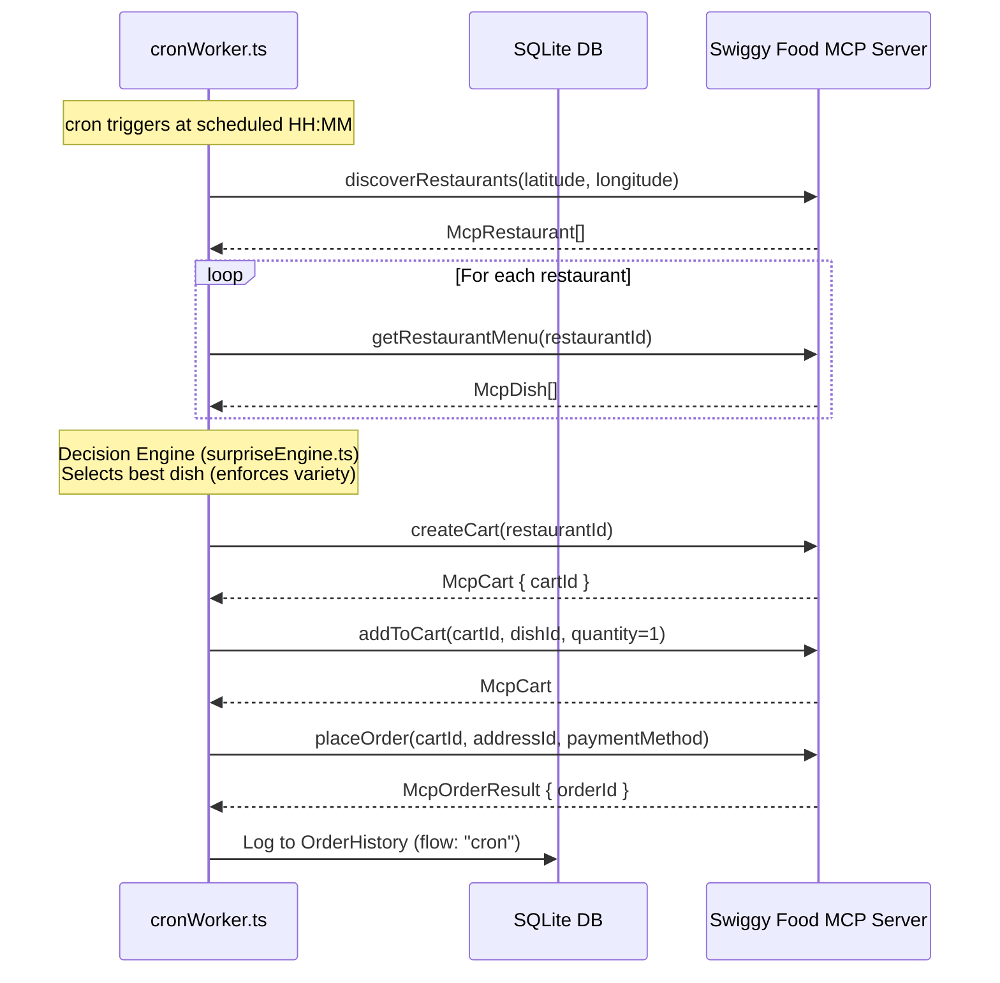

# Moon Bites – Swiggy MCP Tool Chains

This document details the exact sequence of Swiggy Food MCP server tool calls executed by the Moon Bites backend to satisfy each user flow. 

---

## 🎲 1. Surprise Me Flow

The Surprise Me flow selects a single, highly-rated dish from a nearby restaurant within the user's budget and preferred spice level, creates a Swiggy cart, and places the order.

### Sequence Diagram

### Swiggy MCP Tool Details

#### Tool 1: `discoverRestaurants`
- **Purpose**: Search for restaurants in the user's vicinity.
- **Mock Implementation**: `swiggyMcpClient.discoverRestaurants(lat, lng)`
- **Schema**:
  - Inputs: `latitude: number`, `longitude: number`
  - Output: `McpRestaurant[]`

#### Tool 2: `getRestaurantMenu`
- **Purpose**: Fetch menu details for candidate restaurants.
- **Mock Implementation**: `swiggyMcpClient.getRestaurantMenu(restaurantId)`
- **Schema**:
  - Inputs: `restaurantId: string`
  - Output: `McpDish[]`

#### Tool 3: `createCart`
- **Purpose**: Initialize a shopping cart with Swiggy for a chosen restaurant.
- **Mock Implementation**: `swiggyMcpClient.createCart(restaurantId)`
- **Schema**:
  - Inputs: `restaurantId: string`
  - Output: `McpCart`

#### Tool 4: `addToCart`
- **Purpose**: Add the selected dish to the cart.
- **Mock Implementation**: `swiggyMcpClient.addToCart(cartId, dishId, quantity)`
- **Schema**:
  - Inputs: `cartId: string`, `dishId: string`, `quantity: number`
  - Output: `McpCart`

#### Tool 5: `placeOrder`
- **Purpose**: Place the order with a delivery address and payment method.
- **Mock Implementation**: `swiggyMcpClient.placeOrder(cartId, addressId, paymentMethod)`
- **Schema**:
  - Inputs: `cartId: string`, `addressId: string`, `paymentMethod: string`
  - Output: `McpOrderResult`

---

## 😌 2. Mood-Based Recommendations Flow

The Mood flow retrieves a ranked list of 5 suggestions matching the requested mood vibes. It stops at discovery and menu retrieval, presenting options for the user to order later.

### Sequence Diagram

### Swiggy MCP Tool Details
- **Tool 1**: `discoverRestaurants` ➔ Retrieves candidates.
- **Tool 2**: `getRestaurantMenu` ➔ Retrieves dishes to parse and score against mood tags.

---

## 📅 3. Autonomous Schedule Flow

The scheduling flow runs in the background. When the cron schedule fires, the daemon places an order on autopilot.

### Sequence Diagram

### Swiggy MCP Tool Details
- Executes the identical **Cart & Order Tool Chain** (`discoverRestaurants` ➔ `getRestaurantMenu` ➔ `createCart` ➔ `addToCart` ➔ `placeOrder`) fully autonomously.

---

## 🛡️ Robustness & Error Mitigation

In standard production environments, AI-commerce transactions are subject to network drops, rate limits, and checkout failures. To enforce UI/Daemon resilience, the `SwiggyMcpClient` has been designed with a **5% random simulated error rate** throwing the following standardized exceptions:

| Error Code | Simulates | Mitigation Strategy |
|---|---|---|
| `NETWORK_TIMEOUT` | Swiggy endpoint network timeout | UI displays an error alert; cron logs warning and retries on next schedule cycle. |
| `RATE_LIMIT_EXCEEDED` | Exceeding allowed API request rate | Express server responds with HTTP 500 containing code; client backs off. |
| `SWIGGY_INTERNAL_ERROR` | Swiggy transaction processing failure | Prevents corrupt orders from writing to database log history. |
